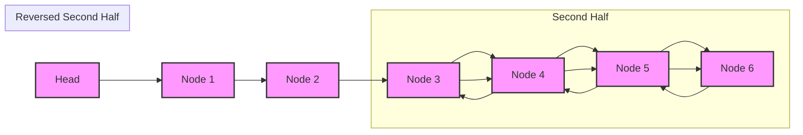

<h2><a href="https://leetcode.com/problems/maximum-twin-sum-of-a-linked-list">2130. Maximum Twin Sum of a Linked List</a></h2>

<p>In a linked list of size <code>n</code>, where <code>n</code> is <strong>even</strong>, the <code>i<sup>th</sup></code> node (<strong>0-indexed</strong>) of the linked list is known as the <strong>twin</strong> of the <code>(n-1-i)<sup>th</sup></code> node, if <code>0 &lt;= i &lt;= (n / 2) - 1</code>.</p>

<ul>
	<li>For example, if <code>n = 4</code>, then node <code>0</code> is the twin of node <code>3</code>, and node <code>1</code> is the twin of node <code>2</code>. These are the only nodes with twins for <code>n = 4</code>.</li>
</ul>

<p>The <strong>twin sum </strong>is defined as the sum of a node and its twin.</p>

<p>Given the <code>head</code> of a linked list with even length, return <em>the <strong>maximum twin sum</strong> of the linked list</em>.</p>

<p>&nbsp;</p>
<p><strong class="example">Example 1:</strong></p>

<pre><strong>Input:</strong> head = [5,4,2,1]
<strong>Output:</strong> 6
<strong>Explanation:</strong>
Nodes 0 and 1 are the twins of nodes 3 and 2, respectively. All have twin sum = 6.
There are no other nodes with twins in the linked list.
Thus, the maximum twin sum of the linked list is 6. 
</pre>

<p><strong class="example">Example 2:</strong></p>

<pre><strong>Input:</strong> head = [4,2,2,3]
<strong>Output:</strong> 7
<strong>Explanation:</strong>
The nodes with twins present in this linked list are:
- Node 0 is the twin of node 3 having a twin sum of 4 + 3 = 7.
- Node 1 is the twin of node 2 having a twin sum of 2 + 2 = 4.
Thus, the maximum twin sum of the linked list is max(7, 4) = 7. 
</pre>

<p><strong class="example">Example 3:</strong></p>

<pre><strong>Input:</strong> head = [1,100000]
<strong>Output:</strong> 100001
<strong>Explanation:</strong>
There is only one node with a twin in the linked list having twin sum of 1 + 100000 = 100001.
</pre>

<p>&nbsp;</p>
<p><strong>Constraints:</strong></p>

<ul>
	<li>The number of nodes in the list is an <strong>even</strong> integer in the range <code>[2, 10<sup>5</sup>]</code>.</li>
	<li><code>1 &lt;= Node.val &lt;= 10<sup>5</sup></code></li>
</ul>


---

# 🛍️ Maximum-Twin-Sum-of-a-Linked-List | Explained

## Approach 1: Two-Pointer Technique with List Reversal
### Intuition
The approach works by finding the middle of the linked list and then reversing the second half of the list. This allows for a simultaneous traversal of the two halves, enabling the calculation of the twin sum for each pair of nodes. The intuition behind this method is to take advantage of the fact that the maximum twin sum will occur when the values of the two nodes being added are the largest. By reversing the second half, we can compare the corresponding nodes from the start and end of the list, which have the potential to produce the maximum twin sum.

### Algorithm Visualized


### Approach
The algorithm can be broken down into the following steps:
1. Find the middle of the linked list using the two-pointer technique (slow and fast pointers).
2. Reverse the second half of the linked list.
3. Traverse the first half and the reversed second half simultaneously, calculating the twin sum for each pair of nodes.
4. Keep track of the maximum twin sum encountered during the traversal.

### Detailed Code Analysis
The code can be divided into two main functions: `reverseList` and `pairSum`. 

- The `reverseList` function takes the head of a linked list as input and returns the head of the reversed list. It uses three pointers: `prev`, `curr`, and `next_node`. The `prev` pointer is used to keep track of the previous node, `curr` is the current node being processed, and `next_node` is used to store the next node in the list before the `curr` node's `next` pointer is modified. The function iterates through the list, reversing the `next` pointers of each node.

- The `pairSum` function takes the head of the linked list as input and returns the maximum twin sum. It uses the two-pointer technique to find the middle of the list. The `slow` pointer moves one step at a time, while the `fast` pointer moves two steps at a time. When the `fast` pointer reaches the end of the list, the `slow` pointer will be at the middle. The function then reverses the second half of the list using the `reverseList` function. Finally, it traverses the first half and the reversed second half simultaneously, calculating the twin sum for each pair of nodes and keeping track of the maximum twin sum.

### Code
```c
struct ListNode * reverseList(struct ListNode* head){
    struct ListNode * prev = NULL;
    struct ListNode * curr = head;
    struct ListNode * next_node = NULL;

    while(curr!=NULL){
        next_node = curr->next;
        curr->next = prev;
        prev = curr;
        curr = next_node;
    }

    return prev;
}

int pairSum(struct ListNode* head) {
    struct ListNode * slow = head;
    struct ListNode * fast = head;

    while(fast!=NULL && fast->next!=NULL){
        slow=slow->next;
        fast=fast->next->next;
    }

    struct ListNode* new_head = reverseList(slow);

    int maxSum = 0;

    while(new_head!=NULL){
        if(head->val+new_head->val > maxSum){
            maxSum = head->val+new_head->val;
        }
        head=head->next;
        new_head=new_head->next;
    }

    return maxSum;
}
```

### Complexity
- **Time:** The time complexity of the algorithm is O(n), where n is the number of nodes in the linked list. The `reverseList` function takes O(n/2) time, and the `pairSum` function takes O(n) time for finding the middle and traversing the list.
- **Space:** The space complexity of the algorithm is O(1), as only a constant amount of space is used to store the pointers and variables. The function does not use any data structures that scale with the input size. 

## 🕵️‍♂️ Follow-up Questions (Optional)
Some potential follow-up questions for this pattern could be:
1. What if the linked list is empty? How would the function handle this case?
Answer: The function would return 0 or a specific value to indicate an empty list, depending on the problem requirements.
2. How would the function be modified to handle a doubly linked list?
Answer: The function would need to be modified to take into account the `prev` pointers in the doubly linked list. The `reverseList` function would need to update the `prev` pointers of each node, and the `pairSum` function would need to traverse the list in both directions.