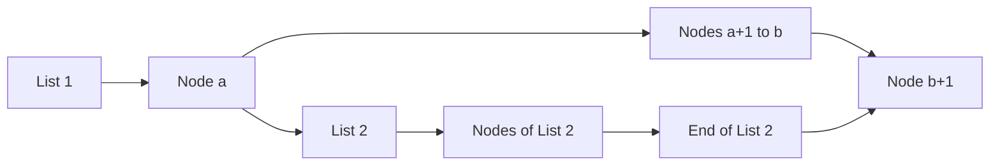

<h2><a href="https://leetcode.com/problems/merge-in-between-linked-lists">1669. Merge In Between Linked Lists</a></h2>

<p>You are given two linked lists: <code>list1</code> and <code>list2</code> of sizes <code>n</code> and <code>m</code> respectively.</p>

<p>Remove <code>list1</code>'s nodes from the <code>a<sup>th</sup></code> node to the <code>b<sup>th</sup></code> node, and put <code>list2</code> in their place.</p>

<p>The blue edges and nodes in the following figure indicate the result:</p>

<p><em>Build the result list and return its head.</em></p>

<p>&nbsp;</p>
<p><strong class="example">Example 1:</strong></p>

<pre><strong>Input:</strong> list1 = [10,1,13,6,9,5], a = 3, b = 4, list2 = [1000000,1000001,1000002]
<strong>Output:</strong> [10,1,13,1000000,1000001,1000002,5]
<strong>Explanation:</strong> We remove the nodes 3 and 4 and put the entire list2 in their place. The blue edges and nodes in the above figure indicate the result.
</pre>

<p><strong class="example">Example 2:</strong></p>

<pre><strong>Input:</strong> list1 = [0,1,2,3,4,5,6], a = 2, b = 5, list2 = [1000000,1000001,1000002,1000003,1000004]
<strong>Output:</strong> [0,1,1000000,1000001,1000002,1000003,1000004,6]
<strong>Explanation:</strong> The blue edges and nodes in the above figure indicate the result.
</pre>

<p>&nbsp;</p>
<p><strong>Constraints:</strong></p>

<ul>
	<li><code>3 &lt;= list1.length &lt;= 10<sup>4</sup></code></li>
	<li><code>1 &lt;= a &lt;= b &lt; list1.length - 1</code></li>
	<li><code>1 &lt;= list2.length &lt;= 10<sup>4</sup></code></li>
</ul>


---

# 🛍️ Merge-In-Between-Linked-Lists | Explained

## Approach 1: Iterative Pointer Movement
### Intuition
The core idea behind this approach is to utilize pointers to traverse and manipulate the linked lists. It works by identifying the start and end nodes of the section to be replaced in the first list, and then connecting the start of the second list to the end of the section being replaced.

### Algorithm Visualized


### Approach
1. Find the node right before the section to be replaced in the first list (start).
2. Find the node right after the section to be replaced in the first list (end of section).
3. Find the last node of the second list (end of list 2).
4. Connect the start node to the first node of the second list.
5. Connect the last node of the second list to the end of the section being replaced.

### Detailed Code Analysis
The code starts by initializing a pointer `start` to the head of the first list. It then moves this pointer `a-1` steps forward to find the node right before the section to be replaced. 

Next, it initializes another pointer `q` to the node right after `start`, which is the start of the section to be replaced. It then moves `q` `b-a+1` steps forward to find the node right after the section to be replaced.

The code then initializes a pointer `end` to the head of the second list and moves it to the end of the second list. 

Finally, it connects `start` to the head of the second list, and `end` to the node right after the section being replaced (`q`).

### Code
```c
struct ListNode* mergeInBetween(struct ListNode* list1, int a, int b, struct ListNode* list2){
    struct ListNode * start = list1;
    for(int i=1; i<a; i++){
        start=start->next;
    }

    struct ListNode * q = start->next;
    for(int i=0; i<(b-a+1); i++){
        q=q->next;
    }

    struct ListNode * end = list2;
    while(end->next != NULL){
        end = end->next;
    }

    start->next=list2;
    end->next = q;

    return list1;
}
```

### Complexity
- **Time:** O(a + b - a + 1 + n), where n is the number of nodes in the second list. This simplifies to O(b + n), which represents the number of nodes traversed in both lists.
- **Space:** O(1), since we are only using a constant amount of space to store the pointers.