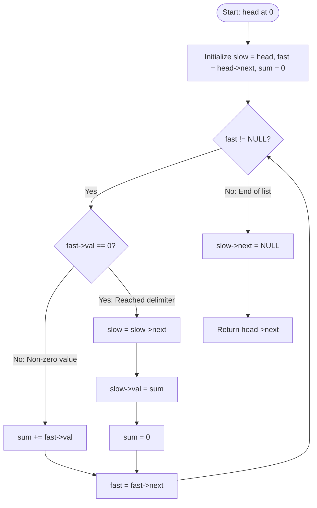

<h2><a href="https://leetcode.com/problems/merge-nodes-in-between-zeros">2181. Merge Nodes in Between Zeros</a></h2>

<p>You are given the <code>head</code> of a linked list, which contains a series of integers <strong>separated</strong> by <code>0</code>'s. The <strong>beginning</strong> and <strong>end</strong> of the linked list will have <code>Node.val == 0</code>.</p>

<p>For <strong>every </strong>two consecutive <code>0</code>'s, <strong>merge</strong> all the nodes lying in between them into a single node whose value is the <strong>sum</strong> of all the merged nodes. The modified list should not contain any <code>0</code>'s.</p>

<p>Return <em>the</em> <code>head</code> <em>of the modified linked list</em>.</p>

<p>&nbsp;</p>
<p><strong class="example">Example 1:</strong></p>

<pre><strong>Input:</strong> head = [0,3,1,0,4,5,2,0]
<strong>Output:</strong> [4,11]
<strong>Explanation:</strong> 
The above figure represents the given linked list. The modified list contains
- The sum of the nodes marked in green: 3 + 1 = 4.
- The sum of the nodes marked in red: 4 + 5 + 2 = 11.
</pre>

<p><strong class="example">Example 2:</strong></p>

<pre><strong>Input:</strong> head = [0,1,0,3,0,2,2,0]
<strong>Output:</strong> [1,3,4]
<strong>Explanation:</strong> 
The above figure represents the given linked list. The modified list contains
- The sum of the nodes marked in green: 1 = 1.
- The sum of the nodes marked in red: 3 = 3.
- The sum of the nodes marked in yellow: 2 + 2 = 4.
</pre>

<p>&nbsp;</p>
<p><strong>Constraints:</strong></p>

<ul>
	<li>The number of nodes in the list is in the range <code>[3, 2 * 10<sup>5</sup>]</code>.</li>
	<li><code>0 &lt;= Node.val &lt;= 1000</code></li>
	<li>There are <strong>no</strong> two consecutive nodes with <code>Node.val == 0</code>.</li>
	<li>The <strong>beginning</strong> and <strong>end</strong> of the linked list have <code>Node.val == 0</code>.</li>
</ul>


---

# 🛍️ Merge-Nodes-in-Between-Zeros | Explained

## Approach 1: In-Place Two-Pointer Modification (Read/Write Pointer)

### Intuition
Think of the linked list as an assembly line of numbered items partitioned by dividers (represented by `0` values). Instead of building a brand-new conveyor belt (allocating new nodes), we can repurpose the existing slots on the belt. 

We use a **fast (read) pointer** to scan ahead, accumulate the sum of numbers between two dividers (`0`s), and a **slow (write) pointer** trailing behind that overwrites existing nodes with the computed sum. Once the end is reached, we truncate the remaining unused nodes by terminating the list with `NULL`.

### Algorithm Visualized



### Approach
1. **Initialize Pointers:**
   - Set `slow = head`. The `slow` pointer will mark the boundary of our newly constructed list.
   - Set `fast = head->next` to start reading the first segment of non-zero numbers.
   - Maintain an accumulator variable `sum = 0`.
2. **Iterate Through List:**
   - As `fast` moves across nodes:
     - If `fast->val != 0`, add `fast->val` to `sum`.
     - If `fast->val == 0`, a segment has concluded. Move `slow` forward by one node (`slow = slow->next`), overwrite its value with `sum` (`slow->val = sum`), and reset `sum = 0`.
3. **Sever Trailing Nodes:**
   - Set `slow->next = NULL` to discard any remaining nodes after the last merged segment.
4. **Return Head:**
   - Return `head->next` because the original `head` (which had a value of `0`) is bypassed.

### Detailed Code Analysis

```c
/**
 * Definition for singly-linked list.
 * struct ListNode {
 *     int val;
 *     struct ListNode *next;
 * };
 */
struct ListNode* mergeNodes(struct ListNode* head) {
    // slow pointer acts as the write pointer, repurposing existing nodes
    struct ListNode* slow = head;
    // fast pointer scans through the values between 0s
    struct ListNode* fast = head->next;
    int sum = 0;

    while (fast != NULL) {
        if (fast->val == 0) {
            // When a zero delimiter is encountered:
            // 1. Advance the write pointer to the next available node
            slow = slow->next;
            // 2. Overwrite that node's value with the merged sum
            slow->val = sum;
            // 3. Reset the running sum for the next segment
            sum = 0;
        } else {
            // Accumulate values between zeros
            sum += fast->val;
        }
        fast = fast->next;
    }

    // Sever the rest of the list so it terminates properly
    slow->next = NULL;

    // head->next points to the first merged node
    return head->next;
}
```

- **`struct ListNode* slow = head;` & `struct ListNode* fast = head->next;`**:
  Initializes two pointers. `slow` lags behind to overwrite values in place, while `fast` traverses forward.
- **`sum += fast->val;`**:
  Gathers the sum of consecutive non-zero node values.
- **`slow = slow->next; slow->val = sum;`**:
  Moves the write pointer to the next spot and rewrites its value in place without invoking memory allocation (`malloc`).
- **`slow->next = NULL;`**:
  Cuts off the rest of the original list, preventing memory cycles or dangling nodes from being accessed by callers.
- **`return head->next;`**:
  The node at `head` was initially `0` and was never overwritten as part of the output; the merged list begins at `head->next`.

### Complexity
- **Time:** $\mathcal{O}(N)$ where $N$ is the total number of nodes in the linked list. We visit each node in the list exactly once via the `fast` pointer.
- **Space:** $\mathcal{O}(1)$ auxiliary space. The operation modifies the list in place by overwriting node values and rewiring pointers without allocating any new nodes.

---

## 🕵️‍♂️ Follow-up Questions

1. **How should we handle memory management in languages without Garbage Collection (like C/C++)?**
   - *Answer:* In C, mutating pointers and dropping nodes (`slow->next = NULL`) leaves the unlinked trailing nodes leaked in heap memory. In a production environment, before setting `slow->next = NULL`, we should traverse and call `free()` on all discarded nodes (`head` and any trailing nodes past `slow`).

2. **Can this problem be solved recursively? What are the tradeoffs?**
   - *Answer:* Yes. A recursive function can sum values until encountering a `0`, set the current node's value to that sum, and recursively call itself for `node->next`. However, recursion consumes $\mathcal{O}(N)$ auxiliary stack space, risking a stack overflow on very large lists. The iterative two-pointer approach is preferred for $\mathcal{O}(1)$ space complexity.